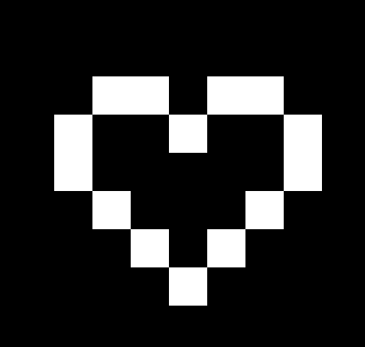
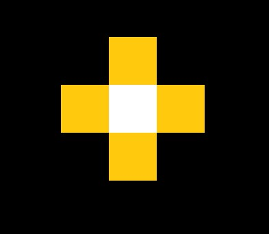

# Pencil

## 0. Introduction

Computer Graphics often deals with digital images, which are made up of pixels. Typically, pixels are stored as 2D arrays of color data in a computer. In this class, we will be storing pixel data as a 1D array. In order to edit these pixels, we change the values stored in the arrays. 

In this lab, you will:

- Learn about how colors and images are represented digitally
- Experiment with making pixel art by modifying an image in code
- And in the end, implement a Photoshop-like "pencil" to draw interactively!

## 1. Before You Begin

Before you begin, here's some basic knowledge you'll need to complete labs (and projects) in CS123:

### 1.1. Stencil Code

Just like in `Lab 1: Setup`, we've provided you with some stencil code to get you started. As always, you should `git clone` this repository to your local machine and open the project in QtCreator.

### 1.2. Application Windows

Run the project by hitting the big "play" button. A blank application window will pop up. This will come in handy later!

[ Image of application window ]

> Interested in how GUI elements like these are set up? Feel free to take a look at [ TODO: these specific files ] in our stencil code!

### 1.3. Command Line Arguments

Most labs and projects in CS123 will use command line arguments to toggle between different configurations, and this lab is no different; specifically, you will be using it to select the type of canvas you wish to use.

[Screenshot of interface to set command line argument]

To set command line arguments, click into the `Projects` tab on the left sidebar. Under `Build and Run > Run > Command Line Arguments`, you can enter command line arguments which will be supplied to the application when it is run.

| Task 1                               |
| :----------------------------------- |
| Change the command line argument ... |

In this lab, we use command [] and [] to control if we want to show a black-and-white canvas or colorful canvas in the application window.

## 2. Representing Colors

In Computer Graphics, **images** are often represented as arrays of **pixels**, which simply store some form of data.

> Technically, pixels can encode any kind of information. Later in CS123, we'll use [height maps](https://en.wikipedia.org/wiki/Heightmap) and [depth buffers](https://en.wikipedia.org/wiki/Z-buffering) to encode linear displacement, and even [normal maps](https://en.wikipedia.org/wiki/Normal_mapping) to encode directions!

Of course, as in digital pictures, pixels are most often used to encode **color** data.

In this section, we'll explore how we can represent color data in code.

### 2.1. Grayscale

A pixel in a grayscale image requires only a single number to encode its intensity:


Conventionally, we define 0 as the darkest color (completely black), and 1 as the lightest color (completely white), as shown above.

Therefore, 0.5 would be gray, and 0.7 would be a lighter shade of gray.

### 2.2. A Note On Datatypes

In grayscale, we use floats ranging from 0 to 1 to represent color intensities.

However, a typical `float` occupies 4 bytes, which is actually a pretty big memory size. Can we manage to make the image look roughly the same with less memory?

The answer is yes! If we only represent colors using integers ranging from 0 to 255, we can occupy only 1 byte per number. 

In C++, this data type is declared as  `uint8_t`, and we will be using it through out this course.

### 2.3. RGBA

But grayscale images are kinda boring :(

Throughout this course, we define colors using the red-green-blue-alpha (RGBA) model. Here, pixels have 4 color channels: red, green, blue and alpha.

The alpha channel represents the opacity of the color. You will work more with this concept in your project. For now, let's focus on red, green, and blue.


As shown above, the RGBA value of (255,0,0) represents a red color. Thus, (255,0,255) mixes blue to red to it to make magenta. 

You can use this [link](https://www.cssscript.com/demo/rgb-color-picker-slider/) to play around with the RGB color sliders. While you play around with the sliders, think about how changing the RGBA values affect the produced color. 

### 2.4. Converting between \[0, 1] and \[0, 255]

In a 0-255 integer representation, we use 255 to denote the MAX color intensity, and use integers between 0 and 255 to represent the colors in between. This is a very common color representation method, and you will be seeing it again and again in this course.

To convert between the above representations, we need to scale the number up or down. For instance, to convert from 0-255 integer representation to 0-1 float representation, simply divide all values by 255. 

| Task 2                                                       |
| :----------------------------------------------------------- |
| In [function location], implement a method to convert 0-1 float representation to 0-255 integer representation.<br/><br/>**HINT**: you might want to check out round() function in cmath library. |

## 3. Your First Canvas

Let’s make a 2D canvas!

### 3.1. Creating "2D" Arrays (does this need to be changed?)

In lab 01, you learned that you can use containers like `std::vector` or `std::array` to store linear collections of data.

<details>
	<summary>What are the differences between these ways of storing data?</summary>
	[Todo](Include information about memory management, make_unique, allocate and delete etc.)
</details>

Wait...these containers are 1D, so how do we represent 2D images?

There are two common ways of doing this:

- row-major order, or
- column-major order 


The example above displays the difference between row major order and column major order when filling a 2x4 array. Notice that the array gets filled row by row when using row major order and column by column when using column major order. In this course, we'll store pixel data in row-major order.

Above is an example of filling indices of a 2 x 4 array. When accessing pixels in an image by their xy coordinates, you should compute its index in the array. 

![ordering or array][imge path]

Remember, we are representing pixel data using a 1D array rather than a 2D array. Refer to the image above to visualize how exactly we are storing the rows. Thus, when given the (x, y) coordinate of the pixel, you will have to compute that pixel's index in the array. 

**task**:

Now, lets create the canvas. We'll start with the basic: creating a grayscale canvas.

- In function [] initialize a "gray canvas" of 10 x 10 pixels by creating a std::vector in [location].

- Set the initial value of all its elements to 123. (Instead of using for loops, you might want to consider faster way of doing it. For example, look up std::fill may help you)

**task**:

- Display what you just created by passing the vector to `displayGrayCanvas()` at [location]
- Compile and run the code with command line input of [...], make sure it's correct!

Your gray canvas should look like this:

![gray canvas image][img path]

### 3.2. Modifying "2D" Arrays (also mildly confusing)

By modifying the values in the array you just created, you can change the color of the corresponding pixels. 

DO WE EVEN NEED THIS?
Try changing a random value in the array to 255 and notice what happens. A white dot should show up on your canvas (this may be a little hard to see since changing a singular value will change a singular pixel). 

Your job in this section, is to work our which pixel correspond to which element in the array, and change their values. Refer to the explanation on row-major-order for hint.

**task:**

- Match “this image” by indexing and changing values of the vector you just created.



**task:**

- Take a screenshot of what you did.

### 3.3. **The RGBA Struct**

Now, it's time to spice things up!

Let's change the canvas to a colorful one. Instead of a std::vector of numbers, we will want a std::vector of something that contains all 4 values of r,g,b,a.

#### 3.3.1. Our CS1230 RGBA Struct

To group several related variables into one place, we should create a struct.

Recall what you learned in Lab01 about structs and how to create them.

A naive RGBA structure should have 4 members: red, green, blue, and alpha. Here's an example of how to define a struct:

```c++
#ifndef NAIVE_RGBA
#define NAIVE_RGBA

struct NaiveRGBA
{
	int r;
	int g;
	int b;
	int a;
}
#endif
```

**task:**

In this task, you will familiarize yourself with structs and creating files in Qt. Define a RGBA struct in your own code by copying the example above into a new header file. 

To create a new file in Qt, right click on the left-side 'Project' bar, and select 'Add New'

You should see an interface asking you to choose which type of file to create. For this task, you should select C/C++ header file.

[Screenshot]

Next, follow the interface instructions: define the name and location of your header file, and in project management section, select 'Done'. You should see a new header file appear in your chosen location after a few seconds.

[screenshot] [screenshot]

(My Qt tabs are in Chinese, need to find a English version to make screen shots)

<details>
  <summary>What does these all mean?</summary>


_Your structure is defined between_

```
#ifndef NAIVE_RGBA
#define NAIVE_RGBA
```

_and_

```
#endif
```

_'NaiveRGBA' is its name_

_Variables between brackets(int r; int g; int b; int a;) are its member variables_

_To make your life easier, you can also create member functions that works on the data members of the structure._

_(Examples of member function)_

</details>

To use the structure you just defined, you can simply include the header file at the top lines of your code and use it. You don't have to do it here, as we have implemented a more complex RGBA structure for you in [location], and linked it for you.

<details>
  <summary>Array of struct</summary>

_An array is a collection of data items of the same type. So, just like ints, floats, chars etc., structs can be put into an array too._

In this course, we put RGBA structures into an array to make up our canvas, like shown below:

*canvas:*

| RGBA | RGBA | RGBA | ...  | RGBA |
| ---- | ---- | ---- | ---- | ---- |

_You can define a std::vector of RGBA structs like this:_

```c++
std::vector<RBGA> rgbaArray
```

_or you can allocate an array of RGBA like this (suppose you have a canvas of 10x10):_

```
RGBA rgbaCArray[100]
```

When an element in the array, for instance, rgbaArray[10] gets accessed, it returns the RGBA value at row 1, column 0

</details>

<details>
  <summary>Extra Info: struct of arrays</summary>

_Alternatively, you can also create a structure of arrays(this example assumes there are 10 x 10 pixels on a canvas):_

canvas:

| red  | red  | red  | ...  | red  |
| ---- | ---- | ---- | ---- | ---- |

| green | green | green | ...  | green |
| ----- | ----- | ----- | ---- | ----- |

| blue | blue | blue | ...  | blue |
| ---- | ---- | ---- | ---- | ---- |

| alpha | alpha | alpha | ...  | alpha |
| ----- | ----- | ----- | ---- | ----- |

*In code, we allocate the canvas as shown below:*

```C++
struct canvas {
	int r[100];
	int g[100];
	int b[100];
	int a[100];
};
```

_So r[0] represent the red intensity of pixel (0,0), g[0] represents the green intensity of pixel(0,0), and so on..._

\*The canvas we use in this class is an array of RGBA, but you are welcome to learn about the other method here: [Array of Structures vs. Array within a Structure in C/C++ - GeeksforGeeks](https://www.geeksforgeeks.org/array-of-structures-vs-array-within-a-structure-in-c-and-cpp/#:~:text=Below is the tabular difference between the Array,a%2C b%2C c%3B } students [ ... )

</details>

#### 3.3.2. Your Mission

Now, let's switch to a canvas that allows us to use colors!

**Task:**

- Modify your previous code to create a canvas with colors instead of grayscale only. Set the pixels such that they have an RGBA value of (0, 123, 123, 1)

Remember that the pixel data is stored in a 1D array. Think about the data structure you want that array to store. 

**Task:**

- Display the canvas by passing the vector to `displayGrayCanvas()` at [location]
- Compile and run the code with command line input of [...]

Your canvas should now look like this:
	
![colored canvas][img path]

**task**:

Now, in `drawFlower(vec2 xy)` at [code location], try changing the pixel at coordinate (x,y) to something other than the initial value. Remember that the pixels are stored in a 1D array, so you will have to calculate the index of that parituclar pixel. 

**Task:**

Try making the function draw a flower with colorful center and petals, sort of like the example below (you can decide the color yourself):



task :

- You can call `drawFlower(vec2 xy)` multiple times and change x,y coordinates to create more pixel flowers.

- take a screenshot of your creation

## 4. The Pencil Tool

Hope you had a little fun drawing flowers! Now, instead of manually modifying the canvas in code, we want to be able to modify it _interactively_.

### 4.1. CanvasWidget

The key to interactivity in Qt is using events handlers.

When events associated with particular _signals_ occur, Qt calls functions known as _slots_. You don’t need to know how to use these since we'll (do our best to) handle everything Qt-related. 
	
Notice the `MouseDown()`, `MouseMove()`, and `MouseUp()` function stubs in the ______ class. These funtions get called when the user interats with the canvas (in other words, when an event occurs). In the next few sections, you'll need to fill in these function stubs in order to make your canvas interactive. 

### 4.2. Pencil

Now, it's time to implement a pencil!

#### 4.2.1. A Note On How To Survive A Weird Compromise: C Arrays

Though we recommend using std::vector (and std::array) for all your canvas needs, Qt’s canvas is weird. Images displayed in Qt have to be of the type 'QImage'. QImages are defined by C arrays. Unfortunately, it's hard to circumvent the usage of QImages, so you'll have to work with C arrays when dealing with Qt. But, the good news is that C arrays are used in the same way!

<details>
  <summary>Want to know why Qt does this?</summary>

We don’t know.

</details>

[By calling canvas->data], your program returns a pointer to the array of canvas pixels, which are RGBA structs. Your [] function returns a xy coordinate of your mouse in canvas space. Again, you need to work on solving the index for your pixel, and find a way to modify it.

#### 4.2.2 Leaky Pencil

Implement `pencilMove` such that it colors the pixel it’s currently on.

#### 4.2.3 Good Pencil

Implement `pencilDown` and `pencilUp` such that the pencil only colors pixels when the mouse is held down.

A Boolean variable in pencil class may be useful.

HINT: What happens when you click without moving?

## 5. Conclusion

Prepare the two screenshots and your good pencil to get checked off!
