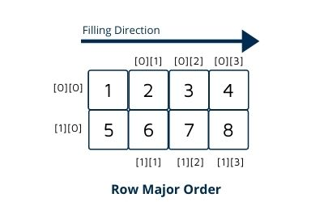
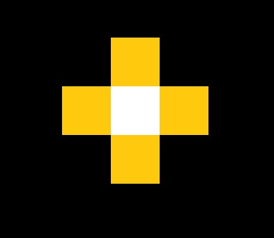

# Pencil

## Introduction

Computer graphics often deals with digital images, which are made up of pixels. Pixels are stored as two-dimensional arrays of color data in a computer. The most straightforward way of creating or editing them is to change the values stored in these arrays.

In the first part of this lab, you will learn the basic way to operate on digital images, and use what you have mastered to create some simple pixel art. In the second part of this lab, you will learn to modify a digital image interactively, and ultimately create a 'pencil' to draw on it, just like one you might use in an image editing application.

## Prologue: Command Line Inputs

Before we start everything about digital images, let's first introduce you to how to use command line inputs in QT.

Sometimes we write different code to do different things, and only want the program to run one of them in one execution. (eg: In this lab, you can choose to enable a black-and-white canvas or a colorful canvas). How do we tell the program what we want it to do then? Command line input is a very convenient way for this!

In Qt, go to the Projects tab on the left, under build and run, under your currently configured kit, click run, and you should have a screen where you can enter command line arguments to run the executable with.

[Screenshot of interface to set command line argument]

## Color

### 1.1. Grayscale

To draw anything, you need to have colors first!

Let's start with only two colors: white and black.

In this case, a color is represented by a single number.

At the moment, let’s define a range that our colors fall within:

Conventionally, we define 0 as the MIN color intensity (completely black), and 1 as the MAX color intensity (completely white in this case).

So, between this range, 0.5 would be a gray color [pic], and 0.7 would be a relatively lighter gray color [pic].

### 1.2. RGBA Conceptually

Okay, so grayscale is boring :(

What if we want more colors?

Throughout this course, we define colors using the Red-green-blue-alpha (RGBA) model. Here, pixels have 4 color channels: red, green, blue and alpha.

The alpha channel represents the transparency of the color. You will work more with this concept in your project. For now, let's focus on red, green and blue.

For Instance, RGBA value of (1,0,0,1) represents a red color [pic], and (1,0,1,1) adds blue to it to make purple [pic].

Observe (0.5,0,1,1) [pic] and (1,0,0.5,1) [pic].

How does the change in RGBA values affect the produced color? 

### 1.3. Notes On Floats and Ints

Earlier, we used floats ranging from 0 to 1 to represent colors.

However, a float variable takes up 4 bytes, which is actually a pretty big memory size. Can we manage to make the image look roughly the same with less memory?

The answer is yes! An integer ranging from 0-255 only takes up 1 byte. Conventionally, we use these to represent the color intensities instead of floats.

DROPDOWN:

Actually,a regular integer takes up 4 bytes(32 bits), and is able to represent numbers much larger than 255. When dealing with colors, however, we only need numbers less than 256.

So, to be more memory efficient, we usually use a special 8-bit integer type to represent colors.  

**Use int ranged 0-255 to represent colors**

In a 0-255 integer representation, we use 255 to denote the MAX color intensity, and use integers between 0 and 255 to represent the colors in between.

This will be the representation method we will be using in this course.

**Conversion Between the Two** 

To convert between the above representations, we need to scale the number up or down. For instance, to convert from 0-255 integer representation to 0-1 float representation, simply divide all values by 255.

**Task:**

In [function location], implement a method to convert 0-1 float representation to 0-255 integer representation.

HINT: you might want to check out round() function in cmath library.

## 2. An Un-interactive Canvas

< picture of bob ross, but the canvas is chunky pixel art >

In order to operate on images, you need an image!

Let’s make a 2D canvas!

### **2.1. The 2D Vector Representation of Canvases**

In lab 01, you learned that we can use [containers](link) like std::vector or std::array to store contiguous data, or allocate a C array.

Collapsible section: Remind me: what are the differences between these ways of storing data? [Todo](Include information about memory management, make_unique, allocate and delete etc.)

However, these are 1-dimensional, and what we need is 2D! The common way of doing it is to arrange elements of the 2D array in a row-by-row (row-major) or column-by-column (column-major) order.



Here, we store them in row-major order, where arrays are arranged sequentially row by row, which means filling all the indices of the first row and then moving on to the next row.

Above is an example of filling indices of a 2 x 4 array.

**task**: 

Now, lets create our very own canvas. We'll start with the basic: creating a grayscale canvas:

* In function ….initialize a "gray canvas" of 5 x 10 pixels by creating a std::vector in [location] .

* Set the initial value of all its elements to 123. (Instead of using for loops, you might want to consider faster way of doing it. For example, look up std::fill may help you)

**task**: 

* Display the canvas by passing the vector to `displayGrayCanvas()` at [location]
* Compile and run the code with command line input of [...]

Do you see a gray box?

**task:**

* Match “this image” by indexing and changing values of the vector you just created.

Refer to the above diagram to work out what the indices should be.

[IMAGE]

**task:**

* Take a screenshot of what you did.

### 2.2. **RGBA Color Representation**

Now, it's time to spice things up!

Let's change the canvas to a colorful one. Instead of a std::vector of numbers, we will want a std::vector of something that contains all 4 values of r,g,b,a.

#### 2.2.1. Our CS1230 RGBA Struct

To group several related variables into one place, we should create a Struct.

Recall what you learned in Lab01 about structures and how to create them.

A naïve RGBA structure should have 4 members: red, green, blue, and alpha. We give you a simple example of how to define it below:

```c++
#ifndef NAIVE_RGBA
#define NAIVE_RGBA

struct NaiveRGBA
{
	int r;
	int g;
	int b;
	int a;
}
#endif
```

**task:**

Try defining a RGBA structure in your own code by copying the above code into a new header file.

To create a new file in QT, right click on the left-side 'Project' bar, and select "Add New"

You should see an interface asking you to choose which kind of new file you want to add. In our task, you should select C/C++ header file.

[Screenshot]

Next, follow the interface instructions, define the name and location of your header file, and in project management section, select 'Done'. You should see a new header file appear in your chosen location after a few seconds.

[screenshot] [screenshot]

(My Qt tabs are in Chinese, need to find a English version to make screen shots)

*Collapsible section:* 

*Your structure is defined between* 

```
#ifndef NAIVE_RGBA
#define NAIVE_RGBA
```

*and* 

```
#endif
```

*'NaiveRGBA' is its name*

*Variables between brackets(int r; int g; int b; int a;) are its member variables*

*To make your life easier, you can also create member functions that works on the data members of the structure.*

*(Examples of member function)*


To use the structure you just defined, you can simply include the header file at the top lines of your code and use it.

You don't have to do it here, as we have implemented a more complex RGBA structure for you in [location], and linked it for you.

*Collapsible section: *

** Array of structs**

*An array is a collection of data items of the same type. So, just like ints, floats, chars etc., structs can be put into an array too.*

*For example, you can define a std::vector of RGBA structs like this:*

```c++
std::vector<RBGA> rgbaArray
```

*or you can allocate a C array of RGBA like this (suppose you have a canvas of 10x10):*

```
RGBA rgbaCArray[100]
```

When an element in the array, for instance, rgbaArray[10] gets accessed, it returns the RGBA value at row 1, column 0

**Extra Info: struct of arrays**

*Alternatively, you can also create a structure of arrays(this example assumes there are 10 x 10 pixels on a canvas):*

```C++
struct canvas {
	int r[100];
	int g[100];
	int b[100];
	int a[100];
};
```

*So r[0] represent the red intensity of pixel (0,0), g[0] represents the green intensity of pixel(0,0), and so on...*

*The canvas we use in this class is an array of RGBA, but you are welcome to learn about the other one here: [Array of Structures vs. Array within a Structure in C/C++ - GeeksforGeeks](https://www.geeksforgeeks.org/array-of-structures-vs-array-within-a-structure-in-c-and-cpp/#:~:text=Below is the tabular difference between the Array,a%2C b%2C c%3B } students [ ... )

#### 2.2.2. Your Mission

Now, let's switch to a canvas that allows us to use colors!

**Task:**

* Modify your previous code to create a canvas with colors instead of grayscale only. 

Consider the type of variable you want your std::vector to have.

* Set the initial values of RGBA to (0,123,123,1)

**Task:**

* Display the canvas by passing the vector to `displayGrayCanvas()` at [location]
* Compile and run the code with command line input of [...]

What is color of your canvas now?

**task**: 

Now, in `drawFlower(vec2 xy)` at [code location], try changing the pixel at coordinate (x,y) to something other than the initial value. You should work out what its index should be.

**Task:**

Try making the function draw a flower with colorful center and petals, sort of like the example below(You can decide the color yourself):




task :

* You can call `drawFlower(vec2 xy)` multiple times and change x,y coordinates to create more pixel flowers.

* take a screenshot of your creation

## 3. An Interactive Canvas

Hope you had a little fun drawing flowers! Now, Instead of modifying a 2D canvas in code, we want to be able to modify it *interactively*.

### 3.1. CanvasWidget

The key to interactivity in Qt is events. 

When events associated with particular *signals* occur*,* Qt calls functions called *slots*. You don’t need to know how to use these, of course—we’ll (do our best to) handle everything Qt-related for you.

In this class, we will set up the functions that gets called when events occur for you, and you need to fill these functions.

### 3.2. Pencil

The functions `MouseDown()`, `MouseMove()`, and `MouseUp()` are called to change the canvas when the user interacts with the canvas with their cursor/mouse, we will Implement the event handlers in X file

#### 3.2.1. A Note On How To Survive A Weird Compromise: C Arrays

Though we recommend using std::vector (and std::array) for all your canvas needs, Qt’s canvas … so we’ll use C arrays here. However! It’s used the same way.

**Collapsible:* 

**Want to know why Qt does this?*

****We don’t know.***

*Images displayed in QT have to be a type called 'QImage', and they are defined to be C arrays. Unfortunately, this implementation is hard to circumvent, so you have to work with C arrays when dealing with QT.*

[By calling canvas->data], your program returns a pointer to the array of canvas pixels, which are RGBA structs. Your [] function returns a xy coordinate of your mouse in canvas space. Again, you need to work on solving the index for your pixel, and find a way to modify it.

#### 3.2.2 Leaky Pencil

Implement `pencilMove` such that it colors the pixel it’s currently on.
#### 2.2.3 Good Pencil

Implement `pencilDown` and `pencilUp` such that the pencil only colors pixels when the mouse is held down.

A Boolean variable in pencil class may be useful.

HINT: What happens when you click without moving?

## 3. Conclusion

Prepare the two screenshots and your good pencil to get checked off!

